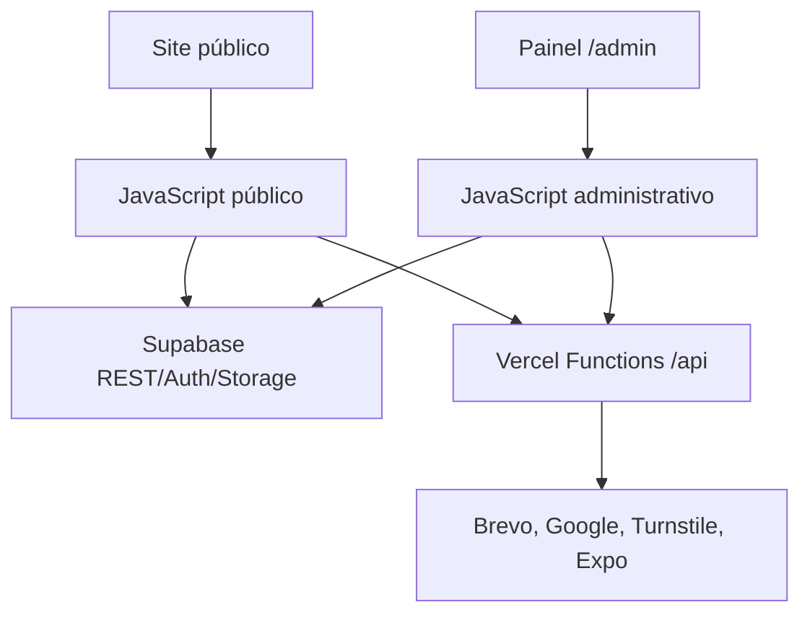

# Arquitetura

O Eu Amo Urânia é um portal público com CMS próprio, usando front-end estático/dinâmico, Supabase como backend principal e Vercel para APIs seguras, rewrites e deploy.

## Camadas

## Site público

Responsável por:

- Home;
- notícias e páginas individuais;
- editorias;
- Guia e empresas individuais;
- Turismo e atrações individuais;
- eventos simples, eventos principais e edições;
- Melhores de Urânia;
- Links;
- Urânia;
- Colabore;
- páginas institucionais;
- SEO, sitemaps, Open Graph e dados estruturados.

O site consome dados do Supabase com chave pública. Dados sensíveis e ações protegidas passam por APIs da Vercel ou RPCs protegidas.

## CMS administrativo

O painel em `/admin` gerencia:

- conteúdo;
- usuários;
- permissões;
- mídia;
- publicidade;
- comunicação;
- audiência;
- configurações;
- premiações;
- eventos.

O painel usa Supabase Auth e permissões por função. Não basta esconder botões: ações relevantes precisam ser protegidas por RLS, RPCs e APIs.

## Banco e dados

O Supabase concentra:

- tabelas editoriais;
- tabelas comerciais;
- tabelas de turismo;
- eventos;
- publicidade;
- newsletter;
- audiência;
- usuários administrativos;
- mídia;
- configurações;
- auditoria;
- Melhores de Urânia.

## APIs serverless

As funções em `/api` são usadas para:

- gerar HTML dinâmico com metadados;
- enviar e-mails;
- registrar aberturas e cliques;
- consultar integrações Google;
- processar votos e indicações;
- enviar notificações;
- gerar sitemaps e feeds;
- proteger chaves secretas.

## Princípios da arquitetura

- Conteúdo público vem do Supabase, não de JSON.
- Segredos nunca ficam no navegador.
- SEO precisa ser resolvido também para crawlers.
- O painel deve ser modular e consistente.
- Métricas internas devem ter fonte clara.
- Rewrites e redirects devem preservar URLs antigas.
- Toda feature nova deve ter documentação e teste.
