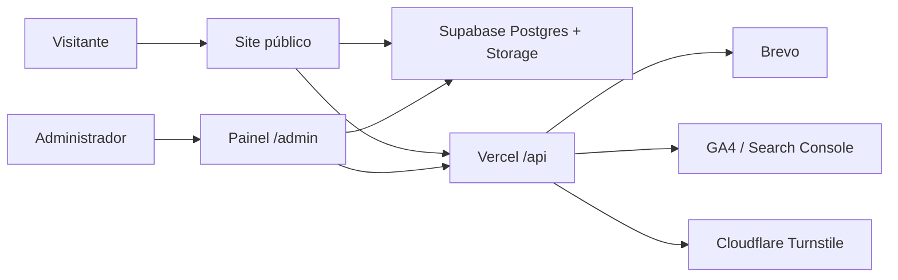

# Sistema completo do Eu Amo Urânia

Última revisão: 19 de julho de 2026.

## 1. Visão geral

O **Eu Amo Urânia** é um portal local com CMS próprio. Ele combina conteúdo público para moradores e visitantes com um painel administrativo completo para gestão editorial, comercial, turística, publicitária, comunicação, audiência e premiações.

O objetivo do sistema é funcionar como um portal regional moderno:

- publicar notícias com SEO e URLs amigáveis;
- apresentar empresas no Guia;
- divulgar turismo e pontos de interesse;
- manter eventos e edições anuais;
- captar colaboradores voluntários;
- gerenciar links e canais oficiais;
- enviar newsletters;
- exibir publicidade interna e Google AdSense;
- acompanhar audiência;
- administrar o prêmio Melhores de Urânia;
- proteger tudo com autenticação, permissões e RLS.

## 2. Arquitetura resumida



Camadas principais:

- **Site público:** páginas estáticas e JavaScript dinâmico.
- **CMS:** painel administrativo em `/admin`.
- **Supabase:** banco, Auth, Storage, RPCs e RLS.
- **Vercel:** deploy, rewrites, redirects, serverless functions e cron.
- **Integrações:** Brevo, GA4, Search Console, AdSense, Turnstile e notificações do app.

## 3. Site público

### Home

A home apresenta a identidade do portal, destaques editoriais, notícias, empresas do Guia, turismo, chamadas de colaboração, newsletter e publicidade.

Regras importantes:

- manter o conceito “Feito em Urânia, para Urânia”;
- exibir notícias publicadas e não futuras;
- priorizar empresas recomendadas/destaques quando houver;
- não exibir espaços vazios quando não houver banners ou conteúdos;
- manter anúncios em posições naturais, sem banner gigante no topo.

### Notícias

Rotas principais:

- `/news/`
- `/noticias/:slug`
- compatibilidade com links antigos via Vercel.

Regras:

- listar apenas notícias com status público `publicado`;
- respeitar `published_at` ou campo equivalente;
- não ordenar por `updated_at`;
- não exibir rascunhos, arquivadas ou agendadas para o futuro;
- páginas individuais usam slug;
- Open Graph deve usar título, resumo e imagem da própria notícia;
- a página individual possui barra de progresso de leitura, tempo estimado e compartilhamento.

### Editorias

As páginas de editoria são geradas dinamicamente por categoria.

Regras:

- não criar página manual para cada categoria;
- usar slug da categoria;
- manter SEO, canonical e Open Graph;
- exibir cabeçalho editorial, destaque, últimas notícias e busca;
- categorias novas devem funcionar automaticamente.

### Guia comercial

Rotas principais:

- `/guia.html`
- `/guia/:slug`
- páginas públicas por categoria do Guia.

Recursos:

- empresas carregadas do Supabase;
- filtro por categoria;
- destaque/recomendado;
- cards compactos no celular;
- página individual com SEO próprio;
- compartilhamento com nome e imagem da empresa;
- links para WhatsApp, Instagram, endereço e mapa;
- seções relacionadas com notícias, turismo, eventos e empresas da mesma categoria.

### Turismo

Rotas principais:

- `/turismo.html`
- `/turismo/:slug`

Recursos:

- pontos turísticos dinâmicos;
- busca por nome, endereço ou experiência;
- cards com imagem, categoria, resumo, localização, horário e botões;
- páginas individuais com SEO;
- seções relacionadas como onde comer, onde se hospedar, outros atrativos e notícias.

### Eventos 2.0

Rotas principais:

- `/eventos/`
- `/eventos/:slug`
- `/eventos/:slug/:ano`

Modelo:

- **evento principal:** página permanente do evento, história, descrição, imagem, SEO e edições;
- **edição:** página específica por ano, com agenda, cartaz, atrações, patrocinadores, galeria e SEO;
- **agenda simples:** eventos pontuais e temporários.

### Melhores de Urânia

Rotas principais:

- `/melhores-de-urania/`
- `/melhores-de-urania/:ano/`
- `/melhores-de-urania/:ano/regulamento/`
- `/melhores-de-urania/:ano/metodologia/`
- `/melhores-de-urania/:ano/resultados/`
- `/melhores-de-urania/:ano/categorias/:slug/`

Regras centrais:

- usar sempre o termo **indicados**, não “finalistas”;
- votação protegida por Turnstile;
- exigir `MELHORES_VOTO_SECRET`;
- votos individuais ficam disponíveis por 7 dias após o encerramento para auditoria;
- depois disso, manter apenas dados consolidados;
- resultado publicado é snapshot histórico e não deve ser recalculado automaticamente.

### Links e canais

Rota:

- `/links`

Apresenta os canais oficiais, grupo de notícias, WhatsApp, notícias e links relevantes. Os itens são gerenciados no CMS.

### Urânia

Rota:

- `/urania/`

Página institucional sobre a cidade, com conteúdo editável no painel e imagem principal configurável.

### Colabore

Rota:

- `/colabore/`

Cadastro voluntário para pessoas interessadas em colaborar com pautas, fotos, relatos, textos e sugestões. A colaboração não cria vínculo, remuneração, obrigação de produção ou garantia de publicação.

## 4. Painel administrativo

Rota:

- `/admin`

O CMS é protegido por Supabase Auth e regras de permissão. Os menus devem aparecer de acordo com a função do usuário.

Módulos principais:

- Visão geral;
- Notícias;
- Aprovações;
- Colaborações;
- Guia comercial;
- Turismo;
- Links;
- Agenda simples;
- Eventos principais;
- Edições de eventos;
- Publicidade;
- Comunicação;
- Notificações do app;
- Melhores de Urânia;
- Categorias;
- Audiência;
- Mídia;
- Usuários;
- Configurações;
- Importar JSON.

## 5. Usuários e permissões

Funções:

- **Super Admin:** acesso total.
- **Administrador:** quase tudo, exceto ações sensíveis de Super Admin.
- **Editor:** notícias, aprovações e categorias editoriais.
- **Redator:** cria notícias próprias e envia para aprovação.
- **Comercial:** Guia e Publicidade.
- **Comunicação:** newsletter, links e assinantes.
- **Visualizador:** somente leitura.

As permissões não devem depender apenas de menus escondidos. Devem existir validações em:

- frontend;
- APIs;
- RPCs;
- RLS;
- políticas do Supabase.

## 6. Fluxo editorial

Status público da notícia:

- `rascunho`;
- `publicado`;
- `arquivado`.

Status editorial:

- `rascunho`;
- `em_revisao`;
- `ajustes_solicitados`;
- `aprovado`;
- `publicado`;
- `arquivado`.

Regras:

- Redator cria, edita próprias matérias e envia para aprovação.
- Redator não publica.
- Editor aprova, solicita ajustes ou aprova e publica.
- Administrador e Super Admin possuem ações de Editor.
- Super Admin pode publicar diretamente sem passar por aprovação.
- Solicitação de ajustes exige comentário.
- O processo é registrado em `cms_atividades`.

## 7. Audiência e estatísticas

O sistema usa eventos internos para medir:

- visualização de página;
- visualização de notícia;
- visualização de empresa;
- visualização de turismo;
- visualização de evento;
- cliques em WhatsApp;
- cliques externos;
- buscas realizadas;
- impressões e cliques de publicidade;
- dados do Melhores de Urânia;
- dados de campanhas de e-mail.

Regras:

- evitar duplicação excessiva de eventos;
- não armazenar dados pessoais ou IP sem necessidade;
- manter origem das métricas documentada;
- usar Supabase como fonte interna principal;
- GA4 e Search Console são integrações complementares.

## 8. Comunicação e newsletter

Recursos:

- assinantes com interesses;
- campanhas de e-mail;
- envio de teste;
- envio manual;
- agendamento;
- histórico de envios;
- descadastro;
- métricas de abertura e clique quando disponíveis;
- newsletter mensal assistida.

A newsletter mensal:

- gera rascunho no CMS;
- usa dados dos últimos 30 dias;
- inclui notícias mais acessadas, empresas visitadas e novidades;
- não envia automaticamente sem revisão;
- impede duplicidade da mesma edição mensal;
- usa o serviço de e-mail já existente.

## 9. Publicidade

O módulo de publicidade gerencia campanhas próprias.

Campos principais:

- campanha;
- anunciante;
- logo;
- tipo;
- imagem;
- link;
- botão;
- prioridade;
- status;
- início e término;
- posições;
- métricas.

Regras:

- não usar banner fixo gigante no topo;
- anúncios devem aparecer de forma natural no conteúdo;
- exibir somente campanhas ativas e dentro do período;
- não deixar espaços vazios;
- design responsivo, minimalista e premium;
- imagens devem poder ser escolhidas pela biblioteca de mídia;
- AdSense é complementar e separado da publicidade própria.

## 10. Biblioteca de mídia

Recursos:

- upload de imagens;
- seleção de imagem existente;
- recorte por formato;
- metadados;
- identificação de uso;
- proteção contra remoção acidental de imagem em uso.

Regras:

- imagens usadas em notícias, Guia, Turismo, Eventos, Publicidade, Urânia e configurações devem ser reconhecidas como “em uso”;
- assets internos do código não precisam aparecer como mídia editável;
- campos de imagem devem aceitar tanto URL externa quanto caminho interno válido.

## 11. SEO e indexação

O projeto usa:

- title e description dinâmicos;
- canonical;
- Open Graph;
- Twitter Cards;
- dados estruturados;
- sitemap.xml;
- news-sitemap.xml;
- robots.txt;
- redirects e rewrites na Vercel.

Páginas indexáveis importantes:

- Home;
- notícias;
- notícias individuais;
- editorias;
- Guia;
- empresas individuais;
- categorias do Guia;
- Turismo;
- pontos turísticos;
- Eventos;
- eventos principais e edições;
- Melhores de Urânia;
- Urânia;
- Links;
- Colabore.

## 12. Variáveis de ambiente

Variáveis públicas:

- `SUPABASE_URL`;
- `SUPABASE_ANON_KEY`;
- `GA_MEASUREMENT_ID`, quando usado no front-end;
- chave pública do Turnstile, quando usada.

Variáveis sensíveis no Vercel:

- `SUPABASE_SERVICE_ROLE_KEY`;
- `BREVO_API_KEY`;
- `BREVO_SENDER_EMAIL`;
- `GA4_PROPERTY_ID`;
- `GOOGLE_SERVICE_ACCOUNT_JSON`;
- `SEARCH_CONSOLE_SITE_URL`;
- `MELHORES_VOTO_SECRET`;
- segredo do Turnstile;
- `EXPO_ACCESS_TOKEN`, quando notificações do app estiverem ativas.

## 13. Deploy

O deploy principal é feito pela Vercel, a partir da branch `main`.

Antes de publicar:

```bash
npm run validate
npm test
```

Verificar:

- build na Vercel;
- limite de serverless functions no plano Hobby;
- variáveis de ambiente;
- rewrites e redirects;
- sitemaps;
- páginas principais;
- login no admin.

## 14. Backups e restauração

Rotina recomendada:

- backup regular do Supabase;
- exportação de dados críticos antes de migrações grandes;
- testar restauração periodicamente;
- manter rollback apenas quando fizer sentido;
- nunca rodar rollback sem confirmar o impacto.

## 15. Checklist rápido de saúde do sistema

- Home abre e carrega conteúdo do Supabase.
- Notícias aparecem por data de publicação.
- Notícia individual abre por slug.
- Guia lista empresas e abre páginas individuais.
- Turismo lista pontos e abre páginas individuais.
- Eventos abre agenda, eventos principais e edições.
- Links carrega canais cadastrados.
- Melhores de Urânia abre, vota e protege com Turnstile.
- Admin faz login e respeita permissões.
- Mídia permite upload e seleção.
- Publicidade aparece nas posições corretas.
- Newsletter envia teste e registra métricas.
- Audiência registra eventos.
- Sitemaps respondem.
- Google não encontra conflito de canonical.

## 16. Regra de ouro

O site público deve ser leve, rápido e claro. O painel deve ser poderoso, mas organizado. Toda funcionalidade nova precisa preservar:

- Supabase;
- permissões;
- SEO;
- URLs;
- performance;
- responsividade;
- documentação.
